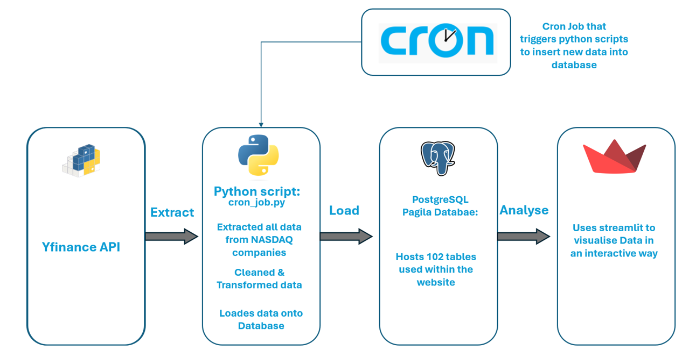
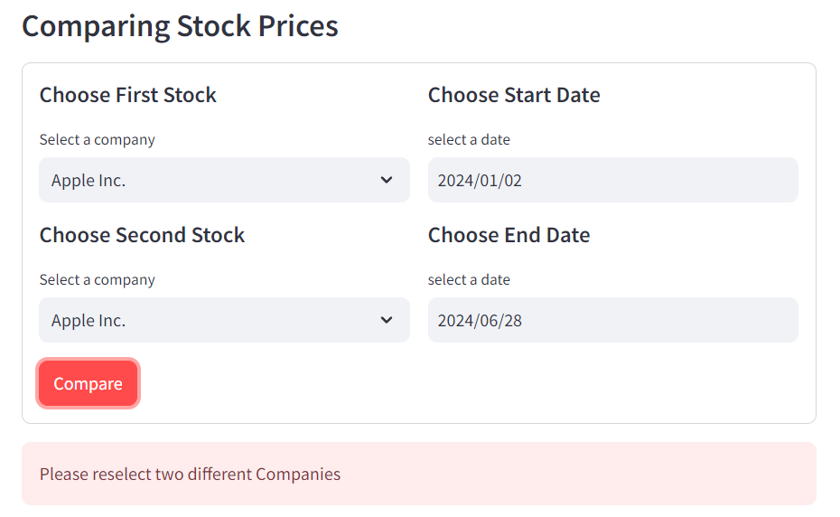
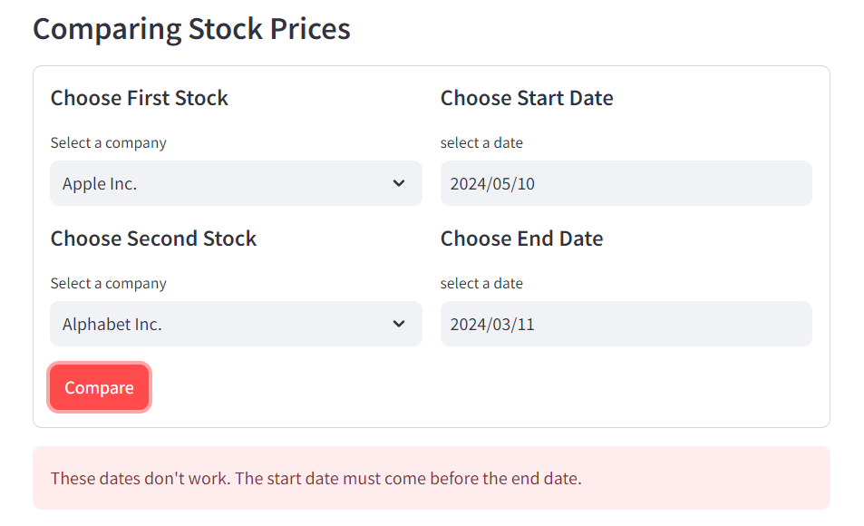
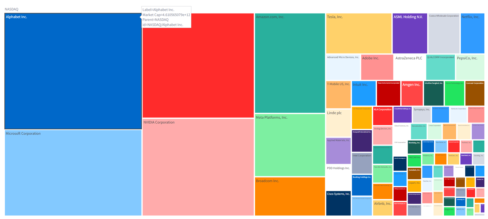
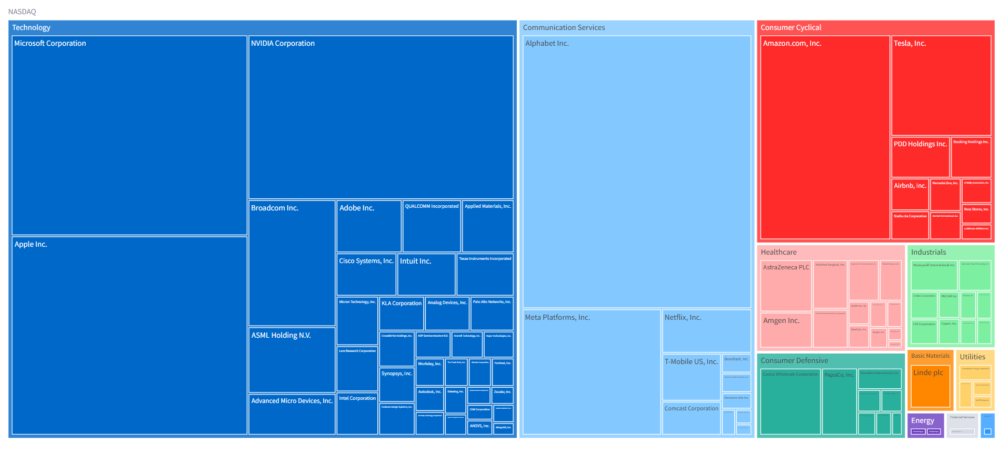
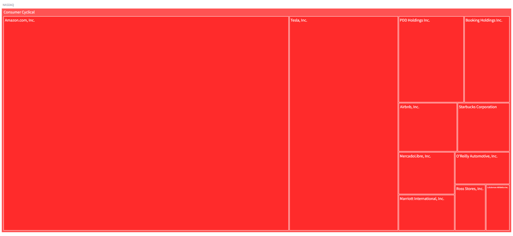

# NASDAQ_visualisations

## Table of Contents

- [Project Brief](#project-brief)
- [Data](#data)
- [Project Pipeline](#project-pipeline)


## Project Brief

This projects aims to teach all individuals about the stock market through the use of the worlds largest non financial companies (NASDAQ-100). This is achieved by creating a website within streamlit that displays a variety of insightful informations about these companies. The financial world is a large industry which everyone interacts with in their life although, not everyone understands,  therefore a platform which teachs about it of great benefit.


## Data

The source of all the data in this project is from the open source tool [yfinance](https://pypi.org/project/yfinance/). This open source tool uses Yahoo's pubically available API's to provide data on a wide variety of stocks. All the companies used in this project can be found on [this](https://stockanalysis.com/list/nasdaq-100-stocks/) website where the company tickers were webscrapped.

The data on yfinance is exported to a postgreSQL database with the use of python scripts where 102 tables sit. Out of those 102 tables, 101 contain hourly historical data about each respective company, the data is from 2024-01-02 and is updated every 12 hours.

### Company stock data columns:

| datetime | open | high | low | close | volume | dividends |
| -------- | ---- | ---- | --- | ----- | ------ |---------- |

The other table contains information about the market captialization of each company as well other relating information.

### Company info columns:

| ticker | name | market_cap | sector | industry | market_cap_billions |
| ------ | ---- | ---------- | ------ | -------- | --------------------|


## Project Pipeline




## crone_job.py

The cron_job python file includes 7 functions that all serve different purposes. Before any functions are made the file scraps a [website](https://stockanalysis.com/list/nasdaq-100-stocks/) for the tickers of the NASDAQ-100 these are used by yfinance to identify companies. 

``` Python
url = 'https://stockanalysis.com/list/nasdaq-100-stocks/'
headers ={
    'User_Agent':'Mozilla/5.0 (Windows NT 10.0; Win64; x64) AppleWebKit/537.36 (KHTML, like Gecko) Chrome/126.0.0.0 Safari/537.36'
}
nas_res = requests.get(url, headers=headers)
NDQ = BeautifulSoup(nas_res.text, 'html.parser')

tickers = [i.text for i in NDQ.findAll('td', class_="sym svelte-eurwtr")]
comp_name = [i.text for i in NDQ.findAll('td', class_="slw svelte-eurwtr")]

NASDAQ = dict(zip(tickers,comp_name))
```

### Updating 101 Stock Data Companies  

#### fetch_new_data()
To update the 101 stock data tables, the delta of data first has to be fetched, this is the role of `fetch_new_data()` function. This function has two inputs ticker and last_retrieval_datetime, to identify the company table and the last time that companies table had been updated. In the function itself that last date time is has an hour added to it and then that is used to find all new data at that time and past it if present. 

#### last_updated()
To get the last time a table was updated last_updated() connects to the postgreSQL database using psycopg2, sql is then used to query the table for the last updated value.


#### cleaning_data()
This function resets the index column which origanally set as the datetime column, this allows for the datetime column to be imported into the postgreSQL database. To add to this there is a redundant column by the name of 'Stock Splits' that is dropped. 


#### updated_db()
The most effective way of importing data into a database is by transforming a the pandas dataframe into separate numpy lines and inserting each line into the database through a for loop.

#### update_db_new_value() 
Combines all the previous functions to update the database for one one of table / company. This function is ran in a for loop to update all other tables shown below:

```Python
if __name__ =="__main__":
    last_time_updated = last_updated()
    for i in NASDAQ:
        update_db_new_value(i, last_time_updated)
```
### Updating market cap table

#### replace_table()
`replace_table()` drops the table within the database if it exists and then creates a new table which will include the updated data from yfinance.

#### get_company_info()
This function simply fetchs new data from yfinance.


## streamlit_visualisations.py 
This file contains all the logic for the streamlit website. The python file is split into various functions that respresent a section of the website. There are two main sections within the website these include the stock price comparison between different companies and the market capitalisation. The main reason to this is so that I can easily move sections of my website around and to implement error handling. 

#### Error Handling 
Since a form with dates is implemented users may enter dates which dont make sense, such as the end date being before than the start date. Finding data like this is impossible therefore conditional statements have been implemented to prevent this. They also prevent a user from selecting a the same stock twice.
```Python
if start_date > end_date:
    st.error("These dates don't work. The start date must come before the end date.")
elif stock1 == stock2:
    st.error("Please reselect two different Companies")
else:
    display_stock_comparing(start_date, end_date,stock1,stock2)
```





#### Graphs

With the website there was a heavy bias towards using plotly graphs due to their high interactability. For instance the market capitalisation tree graph:







